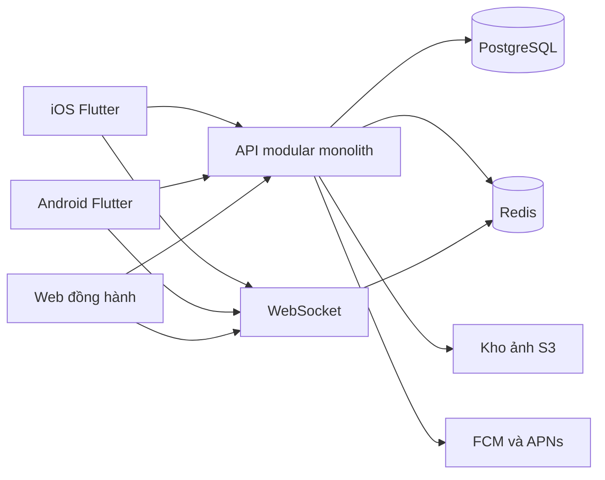
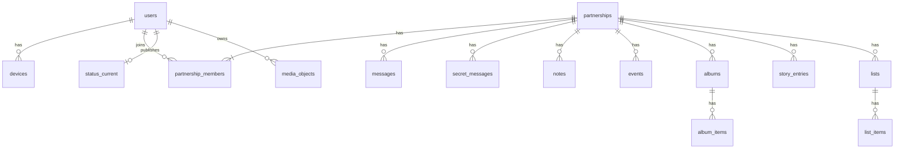
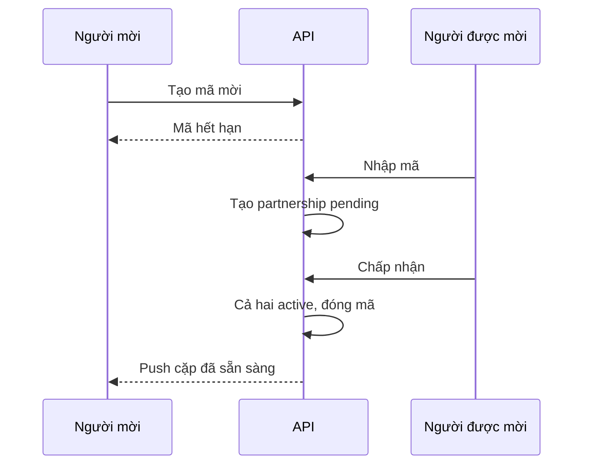

# Thiết kế hệ thống

## Bối cảnh

Client không nói chuyện trực tiếp với database hay kho ảnh. Ảnh tải lên bằng URL có chữ ký, hết hạn trong vài phút.

## Ranh giới

Một tiến trình API phục vụ REST và WebSocket. Tách tiến trình khi chat hoặc ảnh thực sự nghẽn, không tách từ đầu. Các module trong cùng codebase:

| Module | Việc |
| --- | --- |
| identity | Đăng ký, phiên, thiết bị, mã PIN không nằm ở server |
| pair | Mời, chấp nhận, hủy cặp |
| profile | Hồ sơ cặp, ngày bắt đầu, đếm ngày |
| chat | Tin, trạng thái đã xem, sticker |
| secret | Tin cào để mở |
| notes | Ghi chú chung |
| dates | Sự kiện, nhắc, countdown |
| albums | Album và ảnh |
| story | Mốc Our Story |
| lists | Danh sách chung |
| discover | Danh mục gợi ý và mục đã lưu |
| status | Pin, thời tiết, vị trí hiện tại |
| media | Ký URL tải lên và tải xuống |
| notify | Push và hộp thông báo trong app |

Mỗi request gắn `user_id`. Mọi bảng nội dung gắn `partnership_id`. Lớp truy cập từ chối nếu user không còn là thành viên đang hoạt động.

## Dữ liệu

Bảng chính:

- `users`: id, email hoặc phone đã chuẩn hóa, display_name, created_at, deleted_at.
- `devices`: user_id, platform, push_token, last_seen_at.
- `sessions`: user_id, device_id, refresh token đã băm, hết hạn, thu hồi.
- `partnerships`: id, started_on, status `pending | active | closed`, closed_at.
- `partnership_members`: partnership_id, user_id, trạng thái `invited | active | left`. Unique user đang `active` để chặn hai cặp cùng lúc.
- `pair_invites`: mã một lần, người tạo, hết hạn, dùng lúc nào.
- `messages`: partnership_id, sender_id, kind `text | image | sticker`, body, media_id, sticker_id, created_at.
- `message_receipts`: message_id, user_id, delivered_at, read_at.
- `secret_messages`: partnership_id, sender_id, kind, payload, revealed_at.
- `notes`: partnership_id, author_id, body, updated_at.
- `events`: partnership_id, title, starts_at, timezone, kind `anniversary | birthday | plan`, remind_offset.
- `albums`, `album_items`: album, thứ tự, media_id, caption.
- `story_entries`: partnership_id, occurred_on, title, note_id hoặc media_id, position.
- `lists`, `list_items`: tiêu đề, done_at.
- `discover_items`: catalog toàn cục, category `date | gift | quote`, city tùy chọn.
- `saved_items`: partnership_id, discover_item_id.
- `status_current`: một dòng mỗi user. battery_pct, battery_at, location_lat, location_lng, location_at, sharing_battery, sharing_location. Tắt chia sẻ thì xóa giá trị tương ứng trong cùng giao dịch.
- `media_objects`: owner_id, partnership_id, bucket key, mime, bytes, created_at, deleted_at.
- `sticker_packs`, `stickers`.

Ngày bắt đầu quan hệ nằm ở `partnerships.started_on`, do hai người sửa được. Số ngày bên nhau tính khi đọc, không lưu bộ đếm.

`secret_messages.payload` ở bản đầu là nội dung trên server, chỉ API của người nhận trả về sau khi họ gọi “mở”. Client vẽ hiệu ứng cào. Đây không phải mã hóa đầu cuối.

## Luồng ghép đôi

Mã hết hạn và chỉ dùng một lần. Nếu một trong hai đã có cặp active, API từ chối. Hủy cặp chuyển member sang `left`, partnership sang `closed`, xóa `status_current` của cả hai trong cặp đó, và thu hồi URL ảnh. Ảnh xóa bất đồng bộ khỏi kho đối tượng.

## Chat

Client đang mở app giữ WebSocket `partnership:{id}`.

- Gửi tin: REST `POST /partnerships/{id}/messages`, rồi phát sự kiện `message.created` qua Redis cho gateway.
- Đang gõ: chỉ qua socket, không ghi database.
- Đã xem: REST hoặc socket, ghi `message_receipts`.
- App đóng: API gọi push tới token của thiết bị kia. Payload push chỉ có “có tin mới”, không kèm nội dung.

Mất mạng: client giữ hàng đợi cục bộ có id tạm. Khi gửi được, server trả id thật. Client thay id tạm. Server từ chối tin trùng bằng `client_msg_id` unique trong cặp.

## Ảnh

1. Client xin `POST /media/uploads` và nhận URL PUT có chữ ký.
2. Client nén ảnh phía máy, PUT thẳng lên kho.
3. Client gửi `POST /albums/{id}/items` hoặc tin nhắn ảnh với `media_id`.
4. Người kia xem bằng URL GET có chữ ký, hết hạn ngắn.

Worker xóa object khi `deleted_at` đã qua và không còn album, tin, hay story tham chiếu.

## Trạng thái, vị trí, pin

Đây là dữ liệu nhạy cảm. Quy tắc:

- Mặc định tắt cả pin lẫn vị trí.
- Mỗi người chỉ sửa cờ của chính mình.
- Đối phương gọi `GET /partners/{id}/status` và nhận đúng những trường đang bật. Trường đang tắt trả `enabled: false` và không có tọa độ hay phần trăm.
- Tắt vị trí ghi đè lat, lng, location_at về null.
- Không có bảng lịch sử vị trí.
- Không có chế độ chia sẻ mà người kia không thấy là đang bật.
- Quyền hệ điều hành được xin sau khi người dùng bật công tắc trong app.
- Thời tiết lấy theo thành phố trong hồ sơ. Nếu đang chia sẻ vị trí, có thể lấy theo điểm đó và cache ngắn ở server.

## API

Tiền tố `/v1`. Mọi route trừ đăng ký và đăng nhập cần access token.

| Nhóm | Route chính |
| --- | --- |
| Auth | `POST /auth/otp`, `POST /auth/sessions`, `POST /auth/sessions/refresh`, `DELETE /auth/sessions` |
| Cặp | `POST /invites`, `POST /invites/{code}/accept`, `POST /partnerships/{id}/leave` |
| Hồ sơ | `GET /partnership`, `PATCH /partnership` |
| Chat | `GET/POST /partnerships/{id}/messages` |
| Bí mật | `POST /secret-messages`, `POST /secret-messages/{id}/reveal` |
| Notes | `GET/POST/PATCH /notes` |
| Lịch | `GET/POST/PATCH /events` |
| Album | `GET/POST /albums`, `POST /albums/{id}/items` |
| Story | `GET/POST /story-entries` |
| List | `GET/POST /lists`, `POST /lists/{id}/items` |
| Discover | `GET /discover`, `POST /saved-items` |
| Trạng thái | `PUT /me/status`, `GET /partners/{id}/status` |
| Media | `POST /media/uploads` |

Lỗi dùng một dạng: `code`, `message`, `details`. Phân trang cursor theo `created_at, id`.

## Bảo mật

- Access token ngắn, refresh token xoay vòng và lưu dạng băm.
- OTP giới hạn số lần theo số điện thoại hoặc email và theo IP.
- Ảnh không public. Bucket chặn đọc ẩn danh.
- Log không chứa nội dung tin, tọa độ, hay token.
- Khóa PIN và sinh trắc học chỉ ở máy, dùng secure storage của hệ điều hành. Server không nhận PIN.
- Xuất dữ liệu: gói JSON cộng ảnh, chỉ chủ tài khoản tải được, link hết hạn.
- Xóa tài khoản: đóng phiên, xóa push token, gỡ khỏi cặp, xếp hàng xóa ảnh.

## Triển khai chạy

- API và WebSocket stateless, đứng sau một hostname.
- PostgreSQL một primary. Backup tự động trước khi có người dùng thật.
- Redis cho pub/sub socket, hạn mức OTP, và cache thời tiết.
- Kho đối tượng tách bucket theo môi trường.
- Ba môi trường: local, staging, production. Staging dùng bộ dữ liệu giả.
- Biến bí mật nằm ở secret manager, không commit.

## Quan sát

- Mỗi request có request id.
- Metric: độ trễ API, số socket đang mở, hàng đợi xóa ảnh, tỷ lệ push lỗi.
- Cảnh báo khi API 5xx hoặc hàng xóa ảnh kẹt.
- Không dựng dashboard nội dung tin nhắn.
